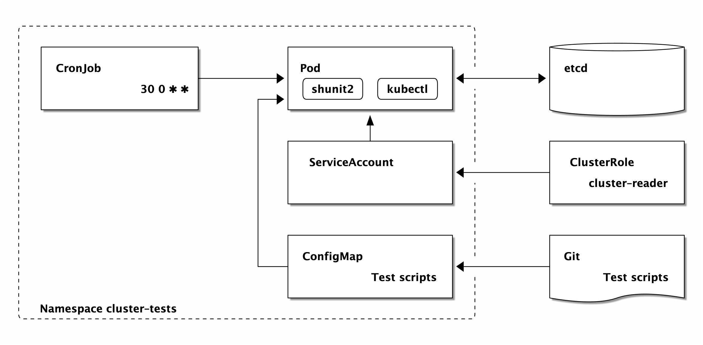
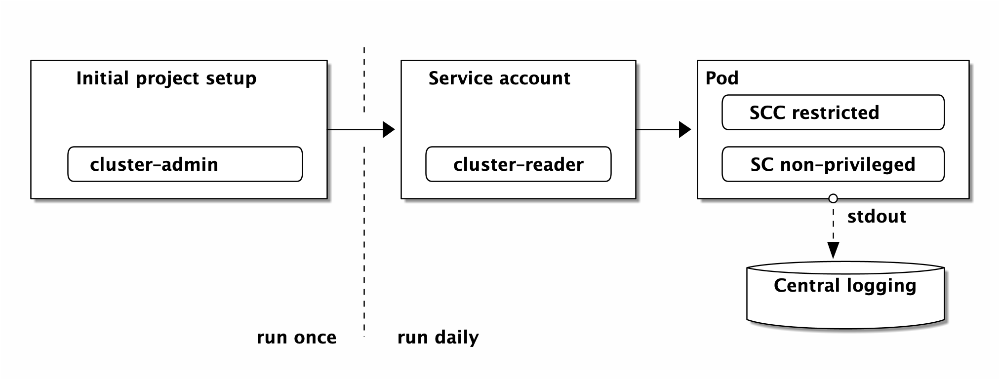

# Kubernetes cluster tests




Use `cluster-tests` to test those aspects of your Kubernetes cluster that are not already covered by monitoring and health checks. Run tests periodically with read-only access to all projects.

For example, you could assert that pods:

* must not run with root privileges
* must not allow privilege escalation
* must not run in privileged security context
* and so on

Admin access is required at the start (to create project and the ClusterRoleBinding for the service account), but from then on access is strictly controlled. Logging is handled via `stdout` as usual and easily filtered in Kibana (or similar) by focusing on the chosen namespace.



The default set of tests includes the following:
```
test
├── cluster_admin_bindings_test
├── escalation_test
├── ha_test
├── healthcheck_test
├── nodes_test
├── privileged_test
├── quotas_test
├── resources_test
└── root_test
```

The `exports` file exports variables such as `USER_NAMESPACES` and `NODES`, which can then be used and reused freely in tests.

The test pod has `kubectl`, `jq`, and so on to examine the cluster from within, with read access across namespaces. It mounts the test scripts (stored in a ConfigMap) and runs each one in turn.

A test can also be triggered for a specified set of namespaces (often just one, for use in a pipeline).

## Install the Helm chart
```
$ make install
helm install --name=k8s-cluster-tests .
NAME:   k8s-cluster-tests
LAST DEPLOYED: Sun Sep 30 23:48:08 2018
NAMESPACE: default
STATUS: DEPLOYED

RESOURCES:
==> v1/Deployment
NAME           AGE
cluster-tests  0s

==> v1beta1/CronJob
cluster-tests  0s

==> v1/Pod(related)

NAME                           READY  STATUS             RESTARTS  AGE
cluster-tests-6976ffd59-gqbzp  0/1    ContainerCreating  0         0s

==> v1/ResourceQuota

NAME           AGE
cluster-tests  0s

==> v1/LimitRange
cluster-tests  0s

==> v1/ConfigMap
cluster-tests  0s

==> v1/ServiceAccount
cluster-tests  0s

==> v1/ClusterRole
cluster-reader  0s

==> v1/ClusterRoleBinding
cluster-tests                 0s
cluster-tests-cluster-reader  0s
```

## Run the tests
```
$ kubectl get po
NAME                        READY     STATUS    RESTARTS   AGE
k8s-cluster-tests-1-bcp2d   1/1       Running   0          4m 
$ kubectl exec cluster-tests-1-bcp2d k8s-cluster-tests
test_project_quotas
test_nodes_ready
test_nodes_no_warnings
test_security_context_privileged
test_anyuid
test_self_provisioner

Ran 6 tests.

OK
```

## Writing your own tests
To add tests, populate the folder `test` with additional files (each containing one or more Bash functions and an instruction to add them to the test suite).
```
$ make update-configmap
```
This will refresh the configmap from the contents of the `test` folder.

## Cleanup
To uninstall the Helm chart, enter:
```
$ make delete
helm delete --purge k8s-cluster-tests
release "k8s-cluster-tests" deleted
```

## Building the image
Run `make build` to create a bespoke test runner image.

Tag the image as desired and push to Docker Hub or a private registry as appropriate.

## Test the test-runner
Run `make test` to run the tests for the `k8s-cluster-tests` executable in the `bin` folder.
